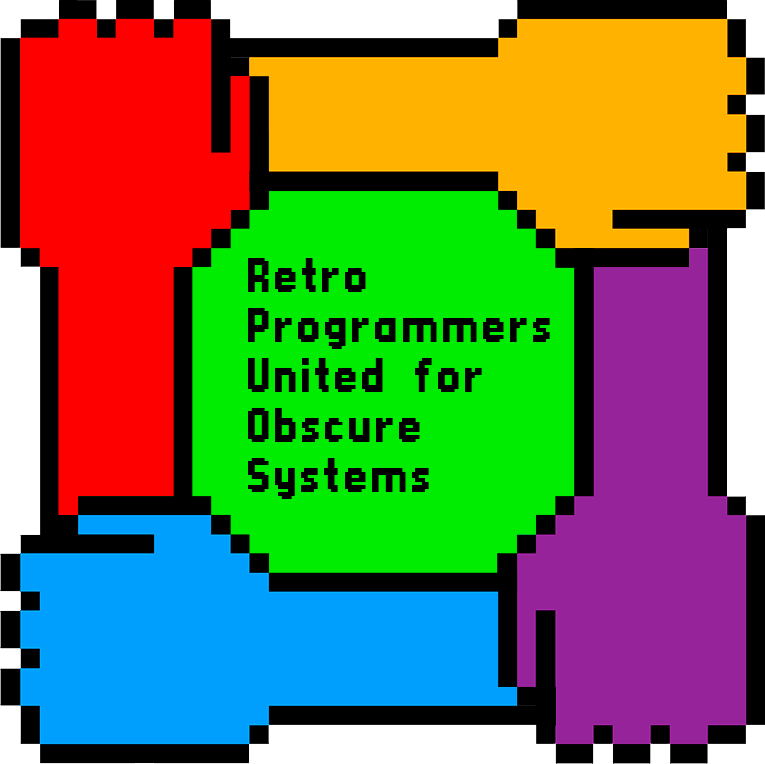

# SinclairQL
RPUFOS Sincler QL project

  

___
## Introduction

Mes travaux sur le Sinclair QL.\
Machine choisi par le groupe RPUFOS pour la période juin 2026 à octobre 2026.

Organisation :

- [library](/library)
  - [documents](/library/documents) (documents que je juge pertinents pour le QL ou documents restaurés par mes soins)
  - [programs](/library/programs) (mes contributions)

Possible qu'à terme je cré une page html pour un équivalent site web de ce repository.

___
## Ressources Web

### Ci-dessous les diverses ressources web trouvées concernant le Sinclair QL qui pourraient vous être utiles :

- [Wikipedia (FR)](https://fr.wikipedia.org/wiki/Sinclair_QL)
- [Wikipedia (EN)](https://en.wikipedia.org/wiki/Sinclair_QL)
- [The Sinclair QL Forum (UK)(hébergé au US)](https://theqlforum.com/)
  - [SInclair QL Wiki](https://qlwiki.theqlforum.com/)
- [Sinclair QL Pages](https://sinclairql.net/) (⚠️ signalé non sécurisé par le navigateur)
  - [QL Documents](https://sinclairql.net/djw/docs/index.html)
  - [QL Software Downloads](https://sinclairql.net/djw/downloads.html)
- [Resources QL THE REPOSITORY](https://sinclairql.net/), idem ci-dessus mais bordélique
- [Documentación Sinclair QL (ES, EN)](https://sinclairql.speccy.org/archivo/docs/docs.htm) (⚠️ last update 2016)
- [The Sinclair QL and QDOS compatible systems site](https://morloch.hd.free.fr/qdos/main.html)
- [The QDOS/SMS software repository](https://morloch.hd.free.fr/smsq/)

### QPC (SMSQ/E)

- [Marcel Kilgus web](https://www.kilgus.net/)

### SMSQmulator

- [Wolfgang Lenerz's website](https://www.wlenerz.com/smsqmulator/), il faut obligatoirement JAVA.

### Autres émulateurs

- [QemuLator](https://www.terdina.net/ql/q-emulator.html), personnellement le meilleurs mais en Shareware, si ok pour vous n'hésitez pas.
- uQLX (QemuLator version *nix)
- [sQLX](https://github.com/SinclairQL/sQLux), problème clavier français
- [ZEsarUX](https://github.com/chernandezba/zesarux), problème clavier français
- [MAME](https://www.mamedev.org/)

voir aussi [page Sinclair QL](https://sinclairql.net/djw/emu/index.html).

### Les ressources des RPUFOS

Les ressources du groupes RPUFOS.

- tomconte
  - [QL](https://github.com/tomconte/ql)
- JgLevieux
  - [Sinclair QL: AsmForBasic](https://github.com/JgLevieux/RPUOS---Sinclair-QL/tree/main/AsmForBasic)
  - [RetroImageConverter](https://github.com/JgLevieux/RetroImageConverter)
- ...

TO DO

___
